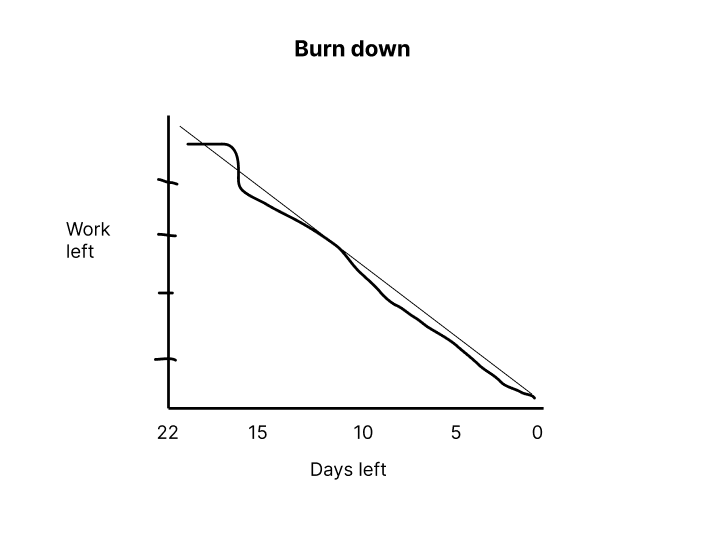

# Actual iteration-3 board,

* Assumed Velocity FROM iteration-2: 0,6
* Total estimated amount of work: 19 days, devided buy 2 developers: 10 days

User stories:
9. Add to favorite (./user_stories/user_story_09_Add to favorite.md), 
- priority 40 (Low)
- 7 days

10. Rating product (./user_stories/user_story_10_Rating product.md)
- priority 40 (Low)
- 7 days

11. Review (./user_stories/user_story_11_Review.md)
- priority 50 (Low)
- 5 days

Progress:
* Userstory 9: 
Developer name: - Task 1: Vi Hoa
                - Task 2: Vi Hoa  
                - Task 3: Linh Hoa
                - Task 4: Linh Hoa
            
Date started : 19/07/2024
Date completed: 23/07/2024

* Userstory 10: 
Developer name: - Task 1: Vi Hoa 
                - Task 2: Linh Hoa  
                - Task 3: Linh Hoa
                - Task 4: Vi Hoa
                - Task 5: Vi Hoa

Date started: 24/07/2024
Date completed: 28/07/2024

* Userstory 11:  
Developer name: - Task 1: Vi Hoa
                - Task 2: Vi Hoa
                - Task 3: Linh Hoa
                - Task 4: Linh Hoa

Date started: 29/07/2024
Date completed: 01/08/2024

### Burn Down for iteration-3:

* Actual Velocity: 0,7