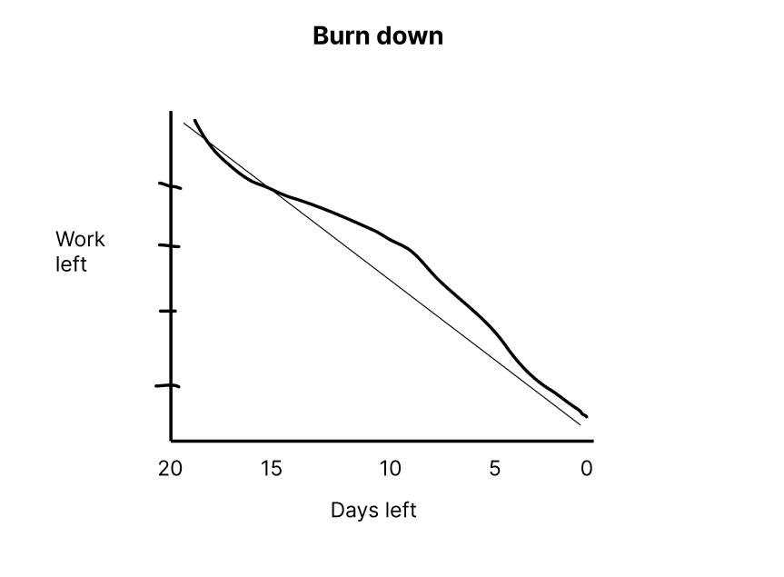

# Actual iteration-1 board, 

* Assumed Velocity: 0.7 
* Number of developers: 2
* Total estimated amount of work: 20 days, devided buy 2 developers: 10 days

User stories:
1. Login (./user_stories/user_story_01_Login.md), 
- priority 10 (High)
- 4 days

2. Signup (./user_stories/user_story_02_Sign up.md)
- priority 10 (High)
- 4 days

3. Browse products (./user_stories/user_story_03_Browse_product.md)
- priority 10 (High)
- 7 days

4. View products details (./user_stories/user_story_04_View products details.md)
- priority 20 (High)
- 5 days

Progress:
* Userstory 1: 
Developer name: - Task 1: Linh Hoa
                - Task 2: Vi Hoa  
                - Task 3: Linh Hoa
            
Date started : 19/06/2024
Date completed: 21/06/2024

* Userstory 2: 
Developer name: - Task 1: Linh Hoa 
                - Task 2: Vi Hoa  
                - Task 3: Linh Hoa

Date started: 21/06/2024
Date completed: 24/06/2024

* Userstory 3:  
Developer name: - Task 1: Vi Hoa
                - Task 2: Linh Hoa
                - Task 3: Vi Hoa
                - Task 4: Vi Hoa

Date started: 24/06/2024
Date completed: 28/06/2024

* Userstory 4: 
Developer name: - Task 1: Vi Hoa
                - Task 2: Linh Hoa
                - Task 3: Vi Hoa
                - Task 4: Vi Hoa

Date started:   28/06/2024
Date completed: 01/07/2024
    
### Burn Down for iteration-1:

* Actual Velocity: 0,7