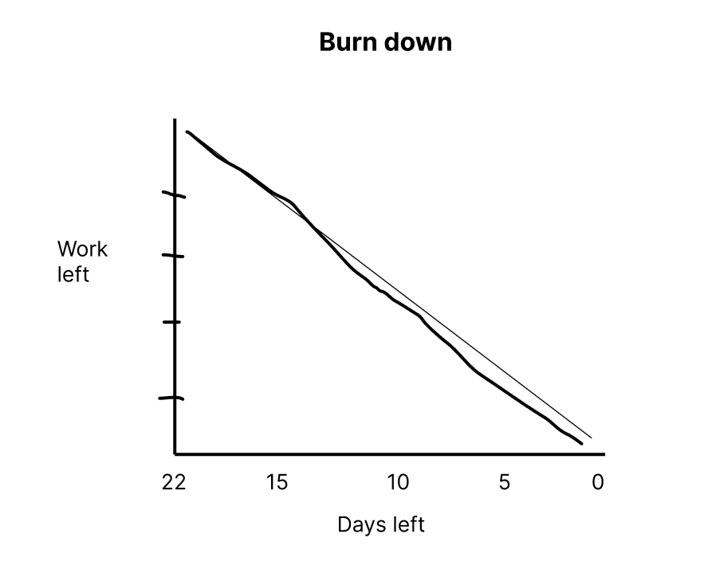

# Actual iteration-2 board,

* Assumed Velocity FROM iteration-1: 0,7
* Total estimated amount of work: 22 days, devided buy 2 developers: 11 days

User stories:
5. Search product (./user_stories/user_story_05_Search product.md), 
- priority 20 (High)
- 5 days

6. Edit user profile (./user_stories/user_story_06_Edit user profile.md)
- priority 20 (High)
- 5 days

7. Add to cart (./user_stories/user_story_07_Add to cart.md)
- priority 30 (Normal)
- 7 days

8. Filtering product (./user_stories/user_story_08_Filtering product.md)
- priority 30 (Normal)
- 5 days

Progress:
* Userstory 5: 
Developer name: - Task 1: Linh Hoa
                - Task 2: Linh Hoa  
                - Task 3: Vi Hoa
                - Task 4: Vi Hoa
            
Date started : 01/07/2024
Date completed: 04/07/2024

* Userstory 6: 
Developer name: - Task 1: Linh Hoa 
                - Task 2: Vi Hoa  
                - Task 3: Vi Hoa

Date started: 05/07/2024
Date completed: 08/07/2024

* Userstory 7:  
Developer name: - Task 1: Vi Hoa
                - Task 2: Vi Hoa
                - Task 3: Linh Hoa
                - Task 4: Linh Hoa

Date started: 09/07/2024
Date completed: 13/07/2024

* Userstory 8: 
Developer name: - Task 1: Vi Hoa
                - Task 2: Linh Hoa
                - Task 3: Vi Hoa
                - Task 4: Vi Hoa

Date started:   14/07/2024
Date completed: 17/07/2024

### Burn Down for iteration-2:

