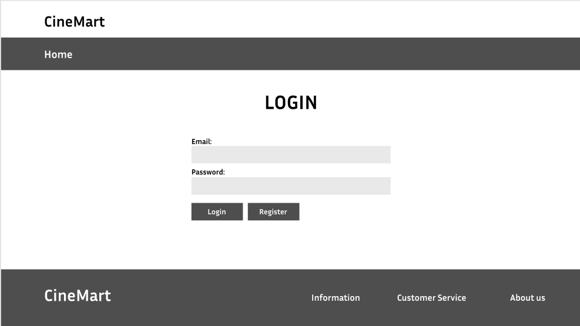
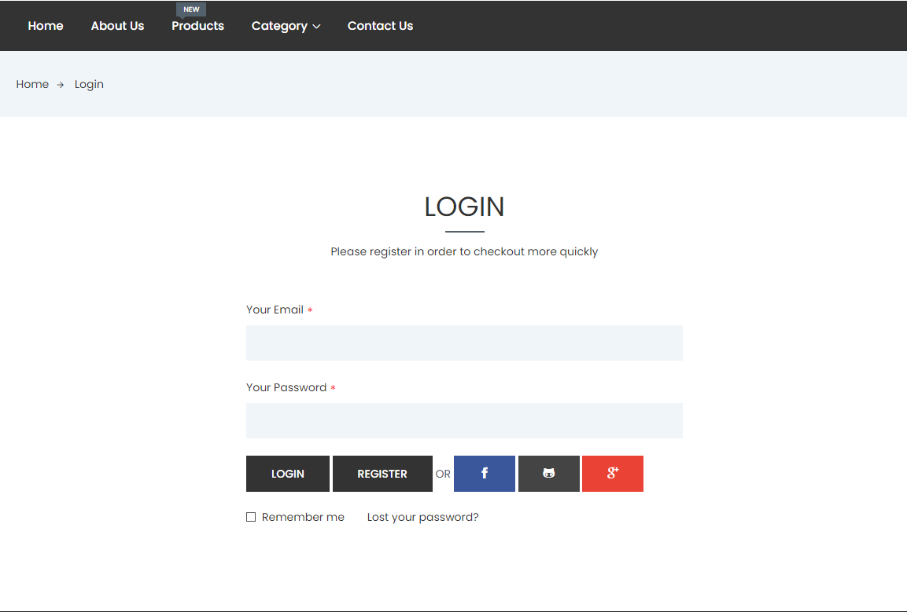

# User story title: Login
Implement Login Functionality

## Priority: 10 (e.g. latest for iteration-1)
Priority: High

## Estimation: 4 days
* Linh Hoa: 2 days (estimated before iteration-1)
* Vi Hoa: 2 days

## Assumptions (if any):

## Description: 
Develop the frontend user interface for the login form, including fields for username and password, and a submit button.

## Tasks:
1. Task 1: Create login form UI 
- Estimation 1 days

2. Task 2: Create the backend logic to handle login requests, including verifying user credentials against the database.
- Estimation 2 days

3. Task 3: Implement the backend and frontend logic to allow users to log out
- Estimation 1 days

# UI Design:

# Completed:

