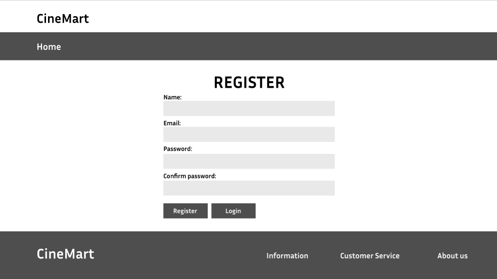
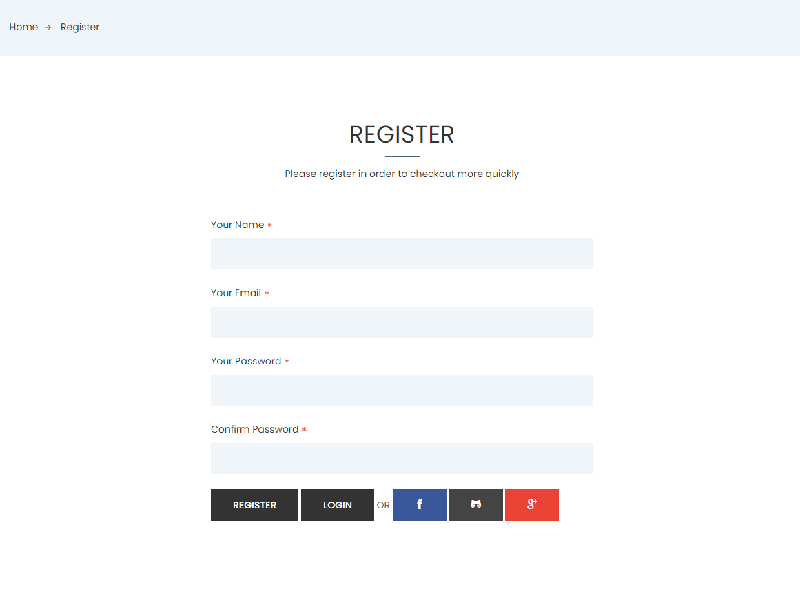

# User story title: Sign up
Implement Signup Functionality

## Priority: 10 (latest for iteration-1)
Priority: High

## Estimation: 4 days
* Linh Hoa: 2 days (estimated before iteration-1)
* Vi Hoa: 2 days

## Assumptions (if any):

## Description: 
Develop the frontend user interface for the signup form, including fields for username, password, email, and any other required information, along with a submit button.

## Tasks:
1. Task 1: Create Signup form UI 
- Estimation 1 days

2. Task 2: Create the backend logic to handle signup requests, including saving user data to the database and hashing passwords for security.
- Estimation 2 days

3. Task 3: Provide user feedback for any errors during the signup process (e.g., username already taken, invalid email)
- Estimation 1 days

# UI Design:

# Completed:

