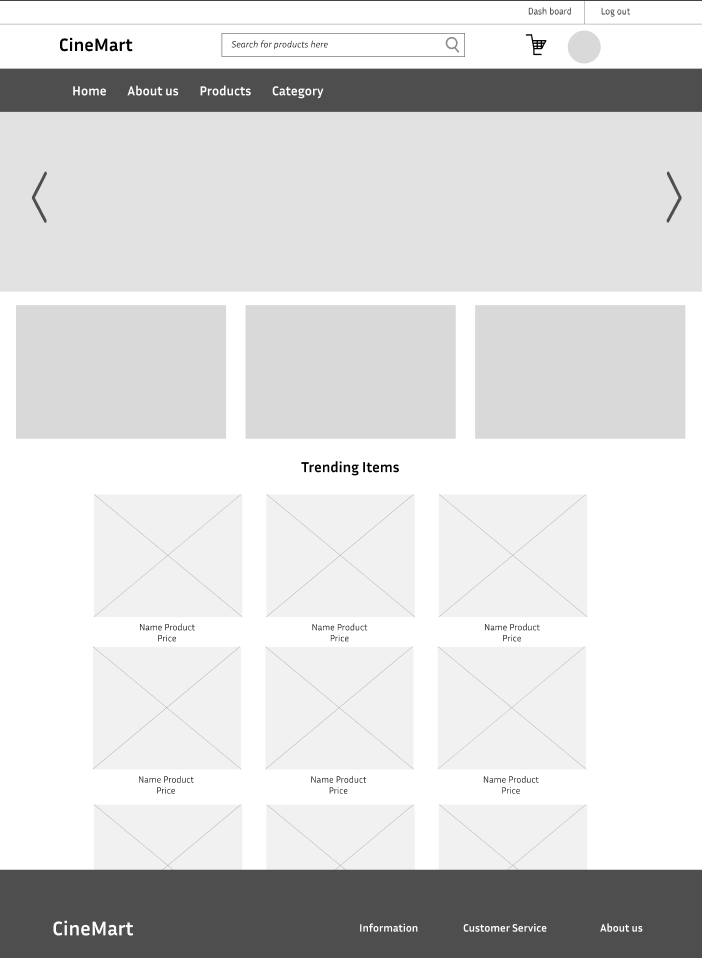
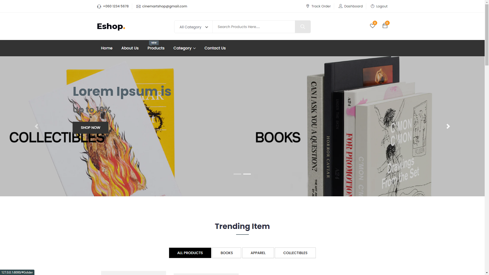
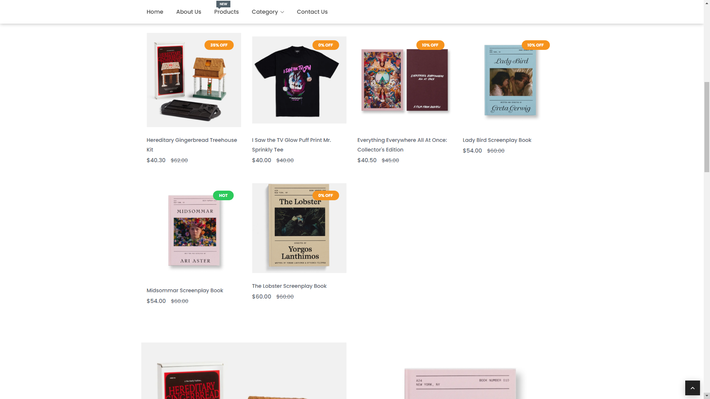
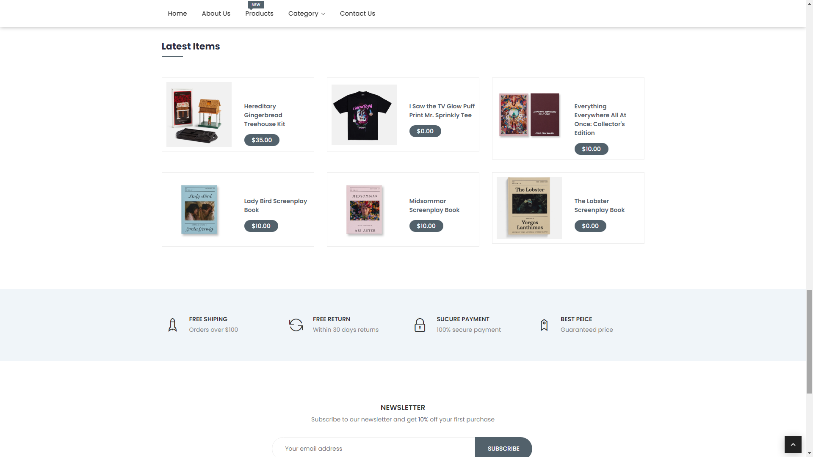

# User story title: Browse products
Implement Browse poducts functionality

## Priority: 10 (latest for iteration-1)
Priority: High

## Estimation: 7 days
* Linh Hoa: 3 days (estimated before iteration-1)
* Vi Hoa: 4 days

## Assumptions (if any):

## Description:
Allow users to browse products on the website so that they can find items to purchase. Develop the frontend user interface to display a list of products, including product images, names, prices, and brief descriptions. 

## Tasks:
1. Task 1: Create product listing UI
- Estimation 2 days

2. Task 2: Implement product filtering functionality.
- Estimation 3 days

3. Task 3: Implement a search feature to allow users to search for products by keywords
- Estimation 1 days

4. Task 4: Handle empty search and filter results
- Estimation 1 days

# UI Design:

# Completed:

