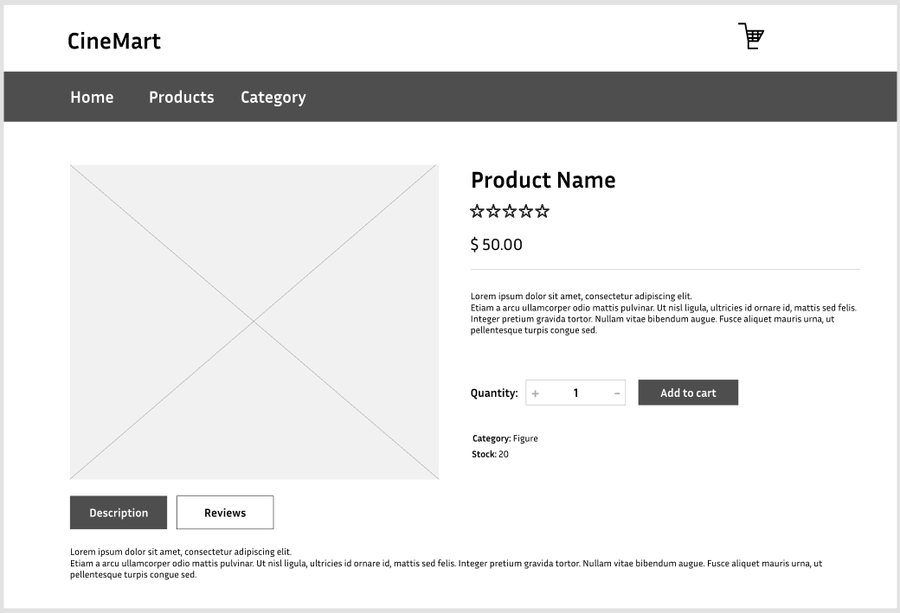
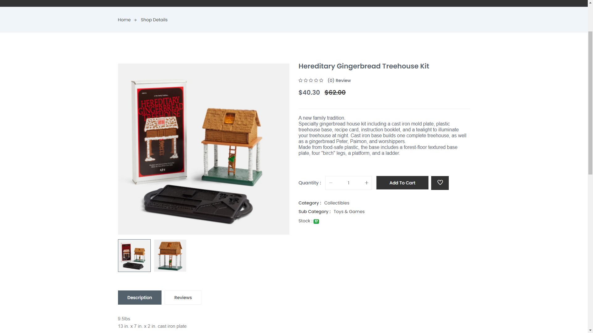

# User story title: View Product Details
Implement View Product Details Functionality

## Priority: 20 (latest for iteration-1)
Priority: High

## Estimation: 5 days
* Linh Hoa: 2 days (estimated before iteration-1)
* Vi Hoa: 3 days

## Assumptions (if any):

## Description: 
Develop the frontend user interface for the product details page, including sections for images, descriptions, reviews, prices, and quality.

## Tasks:
1. Task 1: Create product details UI 
- Estimation 1 days

2. Task 2: Create the backend API to fetch detailed product information from the database and serve it to the frontend.
- Estimation 2 days

3. Task 3: Develop the section to display customer reviews and ratings, including fetching reviews from the database and showing them on the product details page.
- Estimation 1 days

4. Task4: Ensure the product's price and availability are prominently displayed and update dynamically if the data changes.
- Estimation:1 days

# UI Design:

# Completed:

