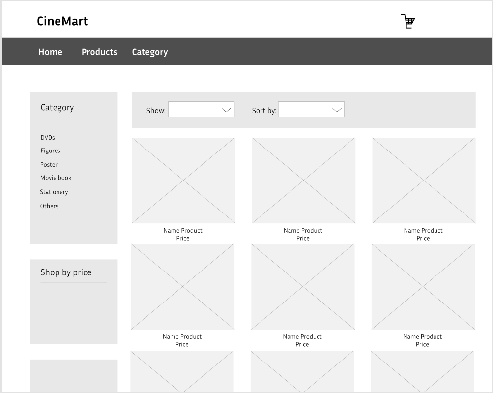
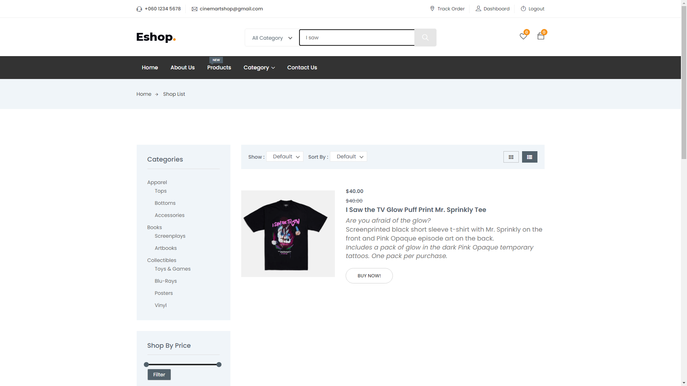

# User story title: Search Product
Implement Search for Products Functionality

## Priority: 20 (latest for iteration-1)
Priority: High

## Estimation: 5 days
* Linh Hoa: 3 days
* Vi Hoa: 2 days

## Assumptions (if any):

## Description: 
Allow users to search for products on the website so that they can quickly find specific items they are interested in. Develop the frontend user interface for the search bar, allowing users to enter search queries.

## Tasks:
1. Task 1: Create search bar UI 
- Estimation 1 days

2. Task 2: Create the backend API to handle search queries, process them, and return relevant product data from the database.
- Estimation 2 days

4. Task 3: Develop the frontend to display the list of products that match the search query, including product images, names, prices,
- Estimation: 1 days

5. Task 4: Provide user feedback and handle cases where no products match the search query, including displaying suggestions for alternative searches.
- Estimation: 1 days

# UI Design:

# Completed:

