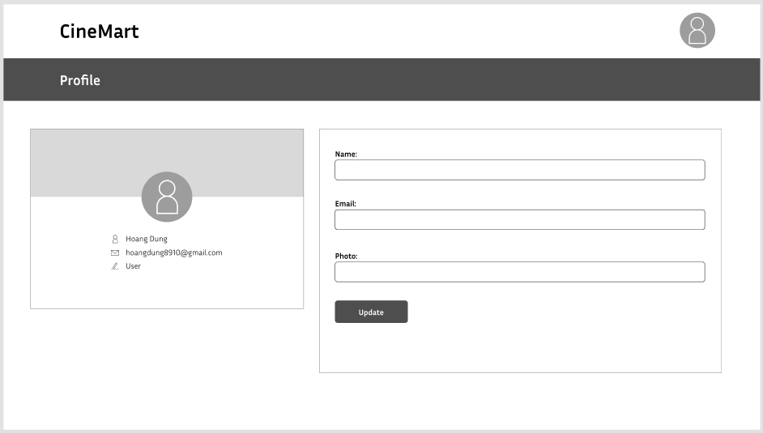
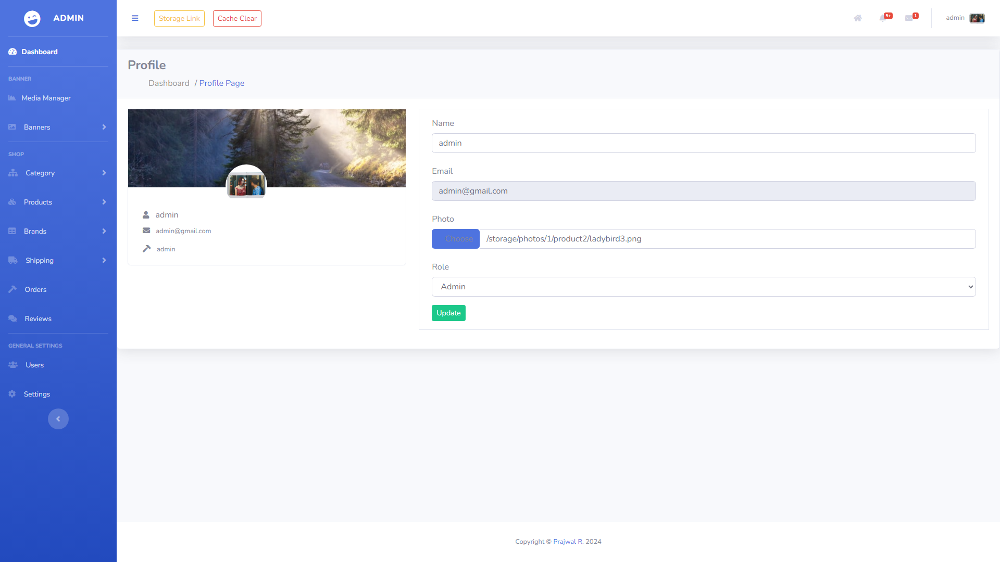

# User story title: Edit User Profile
Implement Edit User Profile Functionality

## Priority: 20 (Iteration 2)
Priority: High

## Estimation: 5 days
* Linh Hoa: 2 days 
* Vi Hoa: 3 days

## Assumptions (if any):

## Description: 
Develop the frontend user interface for the profile editing page, including fields for updating personal information.

## Tasks:
1. Task 1: Create the backend API to handle requests for updating user profile information and saving changes to the database 
- Estimation 2 days

2. Task 2: Add client-side validation to ensure all required fields are filled out correctly before submission (e.g., valid email format, strong password).
- Estimation 2 days

3. Task 3: Provide user feedback for any errors during the profile update process and display a confirmation message upon successful update.
- Estimation 1 days

# UI Design:

# Completed:

