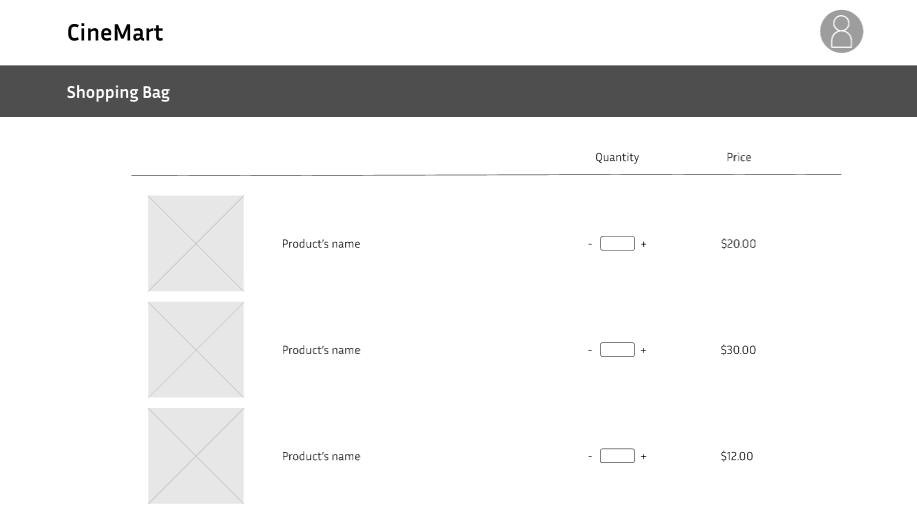
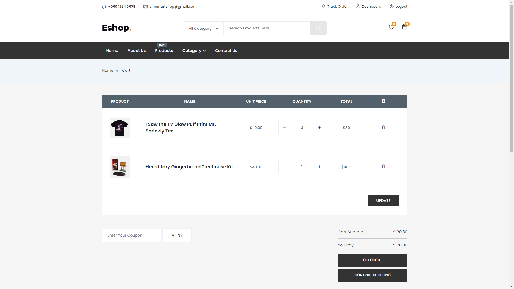

# User story title: Add to cart
Implement Add product to cart Functionality

## Priority: 30 (Iteration 2)
Priority: Normal

## Estimation: 7 days
* Linh Hoa: 4 days 
* Vi Hoa: 3 days

## Assumptions (if any):

## Description: 
Allow user to add products to their shopping cart, so that they can view, add more quatity, delete or purchase the products later.

## Tasks:
1. Task 1: Develop the frontend user interface for the "Add to Cart" button on the product details page and product listings.
- Estimation 1 days

2. Task 2: Add functionality to allow users to specify the quantity of a product before adding it to the cart.
- Estimation 2 days

3. Task 3: Create the backend API to handle requests for adding products to the cart, including updating the cart in the database.
- Estimation 3 days

4. Task 4: Provide user feedback when a product is successfully added to the cart, including a confirmation message and updated cart total.
- Estimation 1 days

# UI Design:

# Completed:

