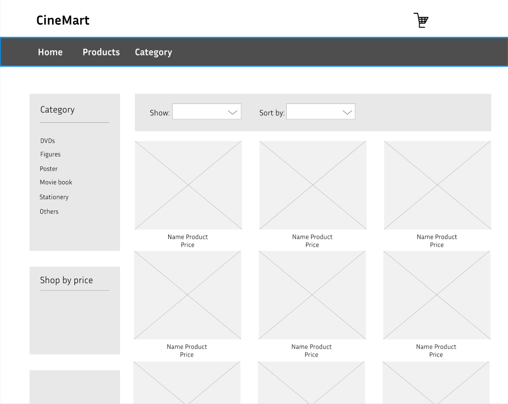

# User story title: Filtering product
Implement Filtering Product Functionality

## Priority: 30 (Iteration 2)
Priority: Normal

## Estimation: 5 days
* Linh Hoa: 2 days 
* Vi Hoa: 3 days

## Description: 
Allow users to filter products by various criteria so that they can easily find items that match their preferences.

## Tasks:
1. Task 1: Develop the frontend user interface for the filtering options, including checkboxes, sliders, and dropdowns for various criteria.
- Estimation 1 days

2. Task 2:  Create the backend API to handle requests for filtering products based on the selected criteria and return the filtered product data.
- Estimation 2 days

3. Task 3: Provide user feedback when no products match the selected filters, including suggestions for adjusting the filters.
- Estimation 1 days

4. Task 4: Add a feature that allows users to clear all selected filters and reset the product list to show all available products.
- Estimation 1 days

# UI Design:

# Completed:

