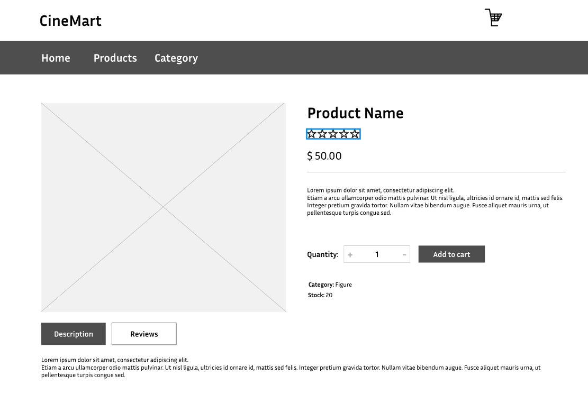

# User story title: Rating product
Implement Rating Product Functionality

## Priority: 50 (Iteration 3)
Priority: Low

## Estimation: 7 days
* Linh Hoa: 4 days 
* Vi Hoa: 3 days

## Description: 
Allow user to rate products so that they can share their opinion and help other customers make informed decisions.

## Tasks:
1. Task 1: Develop the frontend user interface for rating a product, including a visual representation of the rating scale (e.g., stars)
- Estimation 1 days

2. Task 2:  Create the backend API to handle requests for submitting new ratings and updating existing ratings, including updating the database.
- Estimation 2 days

3. Task 3:  Implement functionality to calculate and display the average rating of a product based on all submitted ratings.
- Estimation 2 days

4. Task 4: Ensure that each user can only rate a product once, and their rating is saved and retrievable from the database.
- Estimation 1 days

5. Task 5: Provide user feedback when a rating is successfully submitted or updated.
- Estimation 1 days

# UI Design:

# Completed:

