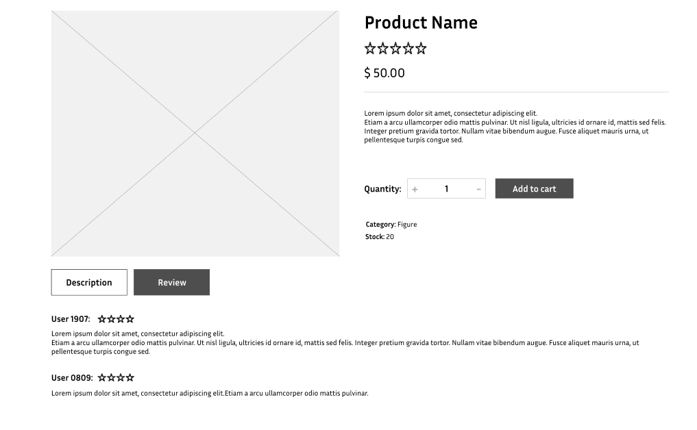

# User story title: Write Review
Implement Write Review Product Functionality

## Priority: 50 (Iteration 3)
Priority: Low

## Estimation: 5 days
* Linh Hoa: 2 days 
* Vi Hoa: 3 days

## Description: 
As a user, they want to write a review for products they have purchased so that they can share their experience and help other customers make informed decisions.

## Tasks:
1. Task 1: Develop the frontend user interface for writing a review, including fields for the review text
- Estimation 1 days

2. Task 2:  Create the backend API to handle requests for submitting new reviews and storing them in the database.
- Estimation 2 days

3. Task 3:   Develop the frontend to display reviews on the product page, including the user's name, rating, and review text.
- Estimation 1 days

4. Task 4: Provide user feedback when a review is successfully submitted, edited, or deleted, including confirmation messages
- Estimation 1 days

# UI Design:

# Completed:

